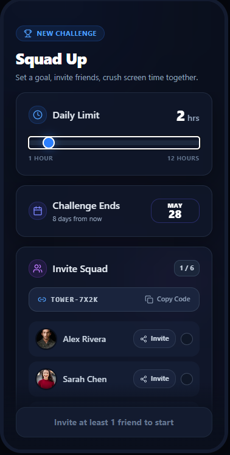
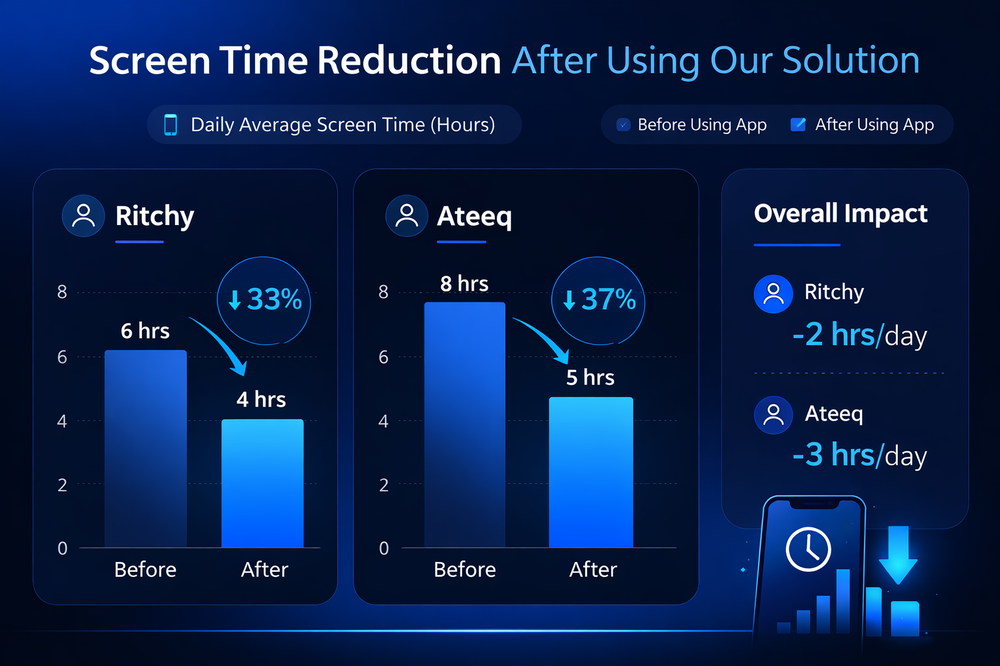
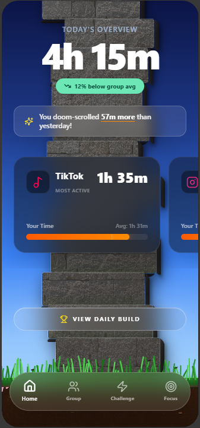

# Active Block

Active Block is a social screen-time accountability app prototype built by Ateeq Rahman and Ritchy Samedy for our engineering capstone. The idea is simple: reducing screen time is easier when friends are working toward the same goal and can see progress together.

Instead of only warning one person about screen time, Active Block turns the goal into a shared challenge. A group sets a daily limit, members log or sync their usage, and the group keeps a stacking tower alive by staying under the limit. If someone goes over, the tower resets.

## What the App Does

- Tracks a user's daily screen-time total in a home dashboard.
- Lets users create a group challenge with a shared daily limit.
- Generates an invite code so friends can join the same group.
- Shows group members, challenge status, and streak progress.
- Supports focus tools like Active Block sessions and Soft Limit reminders.
- Stores group, focus, limit, and usage data through a Supabase backend.

## Why We Built It

Most screen-time apps focus on individual willpower. Our research and testing pushed us toward social accountability instead. The goal was to make screen-time reduction feel more like a group commitment than a private reminder that is easy to ignore.

In our prototype testing, the showcase data showed users cutting daily screen time by multiple hours after using the solution. This is still a school prototype, but the early results helped validate the main idea.

## Tech Stack

- React
- TypeScript
- Vite
- Tailwind CSS
- Supabase Auth and Postgres
- Vercel deployment

## Demo Links

- Live demo: https://active-block-v2.vercel.app
- Research slides: https://docs.google.com/presentation/d/1UJzZA4JgpPEobLWUtJKIoBjGgeFb6QUfB-GbX-_u2PU/edit?usp=sharing

## Project Visuals

These are the polished capstone visuals we use for the public repo instead of random debug screenshots.







## Backend Summary

The backend work in this repo is designed around Supabase:

- Anonymous/demo auth support for prototype signups.
- Profiles for each signed-in user.
- Group creation with shareable join codes.
- Group membership and invite state.
- Shared daily screen-time goals.
- Manual/demo usage logs.
- Active Block focus sessions.
- Soft app limits.
- Daily group checks that add a tower brick or reset the streak.

The database schema and row-level security policies live in:

```text
supabase/migrations/20260527_active_block_backend.sql
```

## Local Setup

```bash
npm install
npm run dev
```

For Supabase sync, copy `.env.example` to `.env.local` and fill in your own project values:

```bash
VITE_SUPABASE_URL=https://your-project-ref.supabase.co
VITE_SUPABASE_ANON_KEY=your-anon-key-here
```

Do not commit `.env.local` or any real database passwords/keys.

## Status

This is a prototype for a class capstone/demo, not a production iOS app. Screen-time tracking is manual/demo-based for now because real iOS Screen Time APIs require Apple permissions. The main goal of this build is to prove the social accountability loop: create a group, set a goal, log usage, see shared progress, and keep the tower alive together.
